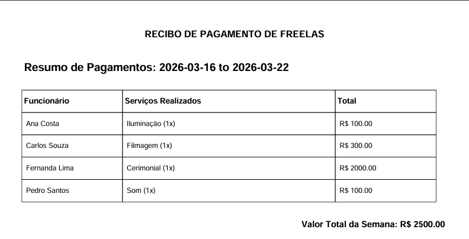

# 🚀 Automação de Folha de Pagamento - Freelancers / Freelance Payroll Automation

[🇧🇷 Português](#pt) | [🇺🇸 English](#en)

---

## 🇺🇸 English

An automated system developed in Python for weekly payment management, integrating Google Sheets API and generating consolidated PDF reports.

### 🛠️ Technologies and Tools
* **Language:** Python 3.10+
* **Data:** Pandas (Processing), Google Sheets API (Data Source)
* **Reporting:** FPDF2 (Dynamic PDF generation with tables)
* **Cloud & CI/CD:** GitHub Actions (Scheduled automation every Friday)
* **Security:** GitHub Secrets and Python-Dotenv

### 📊 Problem vs. Solution
**Problem:** Financial closing for freelancers was manual, prone to typing errors, and consumed hours of weekly auditing.
**Solution:** A bot that reads the timesheet, groups services per employee (e.g., "LED Panel (2x)"), calculates totals, and generates a professional report sent automatically.

### 🛡️ Privacy & Confidentiality Note
This repository is a **Proof of Concept (PoC)**. For confidentiality and data protection:
1. Original spreadsheet data has been replaced with synthetic **mock data**.
2. Production credentials are secured in a private environment.
3. The logic presented here reflects the real architecture without exposing sensitive business data.

---

## 🚀 How it works
1. **Fetch:** Script accesses Google Sheets API.
2. **Transform:** Pandas processes and groups data.
3. **Report:**  FPDF2 generates the report.
4. **Deploy:** GitHub Actions runs the pipeline via Cron Job.

---

## 🇧🇷 Português

Sistema automatizado desenvolvido em Python para gestão de pagamentos semanais, integração com Google Sheets API e geração de relatórios consolidados em PDF.

### 🛠️ Tecnologias e Ferramentas
* **Linguagem:** Python 3.10+
* **Dados:** Pandas (Processamento), Google Sheets API (Fonte de Dados)
* **Relatórios:** FPDF2 (Geração de PDF com tabelas dinâmicas)
* **Cloud & CI/CD:** GitHub Actions (Automação agendada toda sexta-feira)
* **Segurança:** GitHub Secrets e Python-Dotenv

### 📊 O Problema vs. A Solução
**Problema:** O fechamento financeiro de prestadores de serviço era manual, sujeito a erros de digitação e consumia horas de conferência semanal.
**Solução:** Um robô que lê a planilha de horas, agrupa serviços por funcionário (ex: "Painel LED (2x)"), calcula totais e gera um relatório profissional enviado automaticamente.

### 🛡️ Nota sobre Privacidade (LGPD)
Este repositório é uma **Prova de Conceito (PoC)**. Por questões de confidencialidade:
1. Os dados da planilha original foram substituídos por dados sintéticos (*mock data*).
2. As credenciais reais de produção estão protegidas em ambiente privado.
3. A lógica aqui apresentada reflete a arquitetura real, sem expor dados sensíveis da empresa.

## 🚀 Como funciona
1. **Fetch:** O script acessa a Google Sheets API 
2. **Transform:** Pandas processa e agrupa os dados 
3. **Report:** FPDF2 gera o relatório 
4. **Deploy:** GitHub Actions executa o pipeline via Cron Job

## PDF Gerado / Generated PDF

